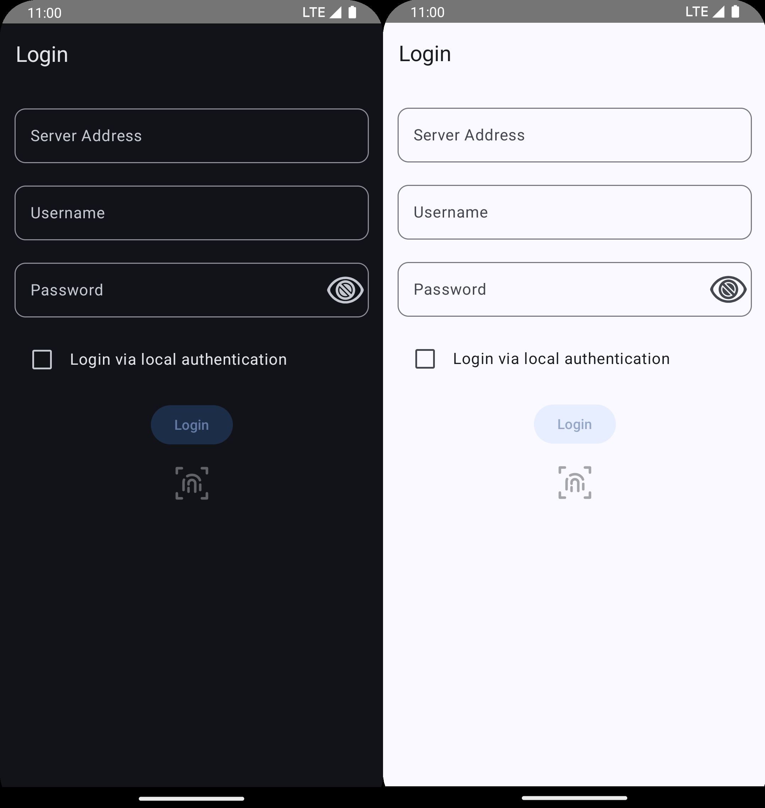
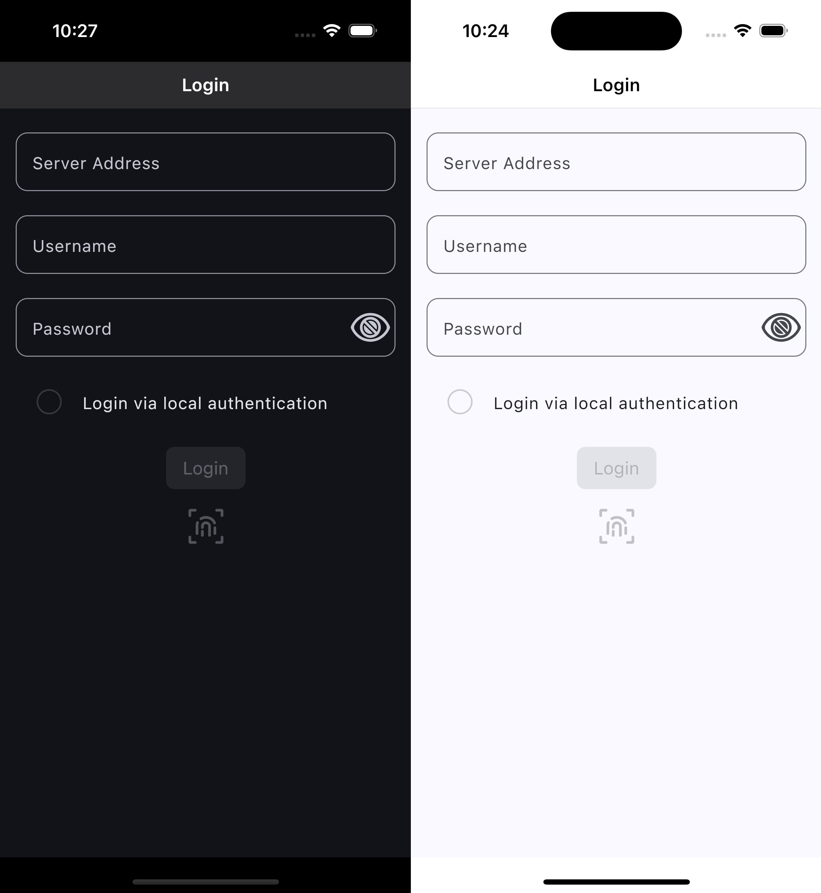
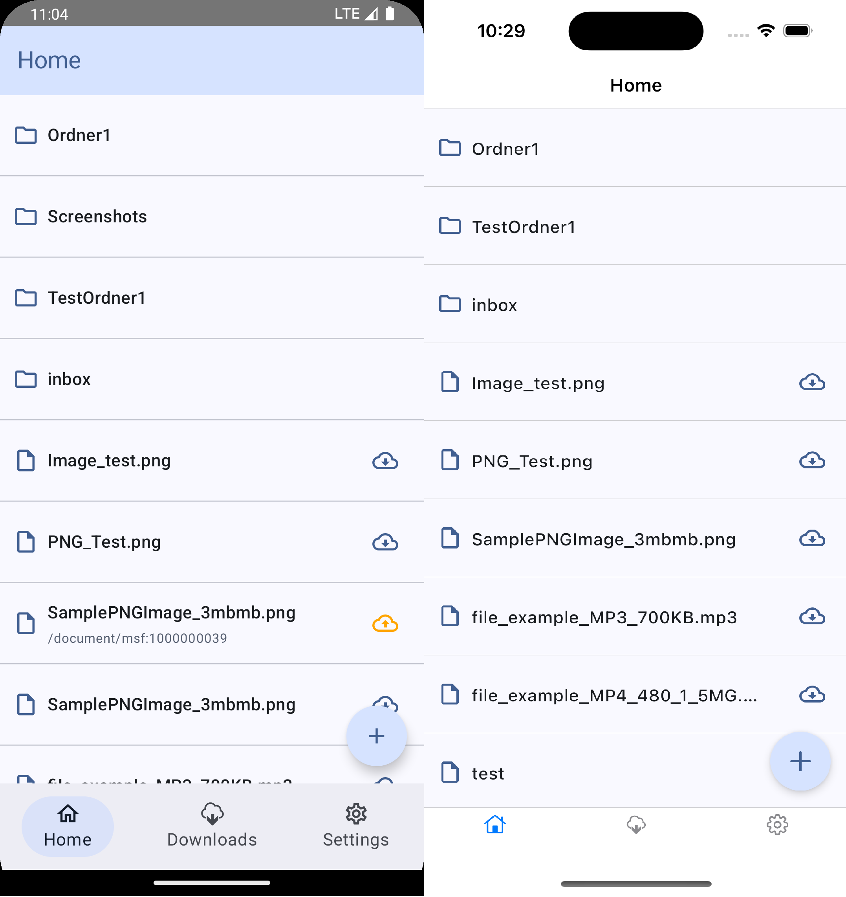
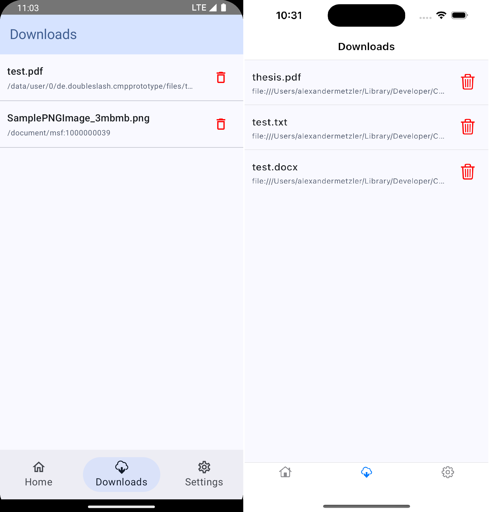
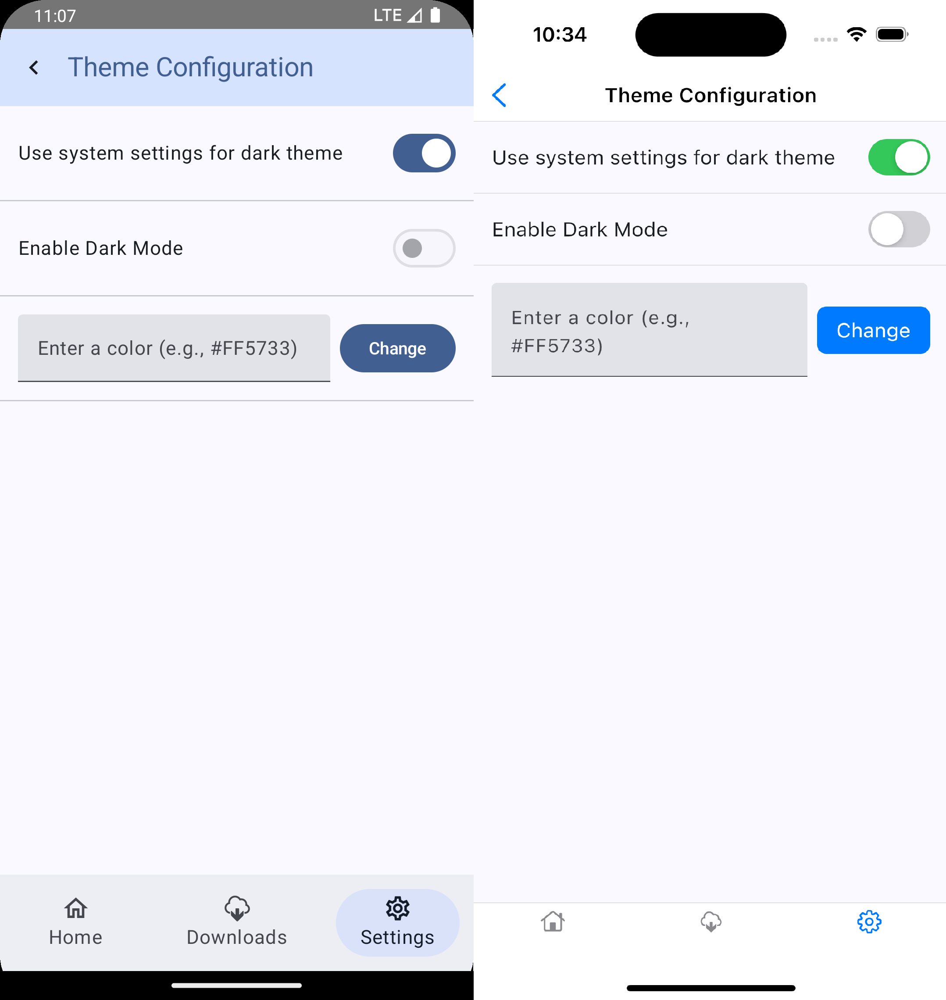
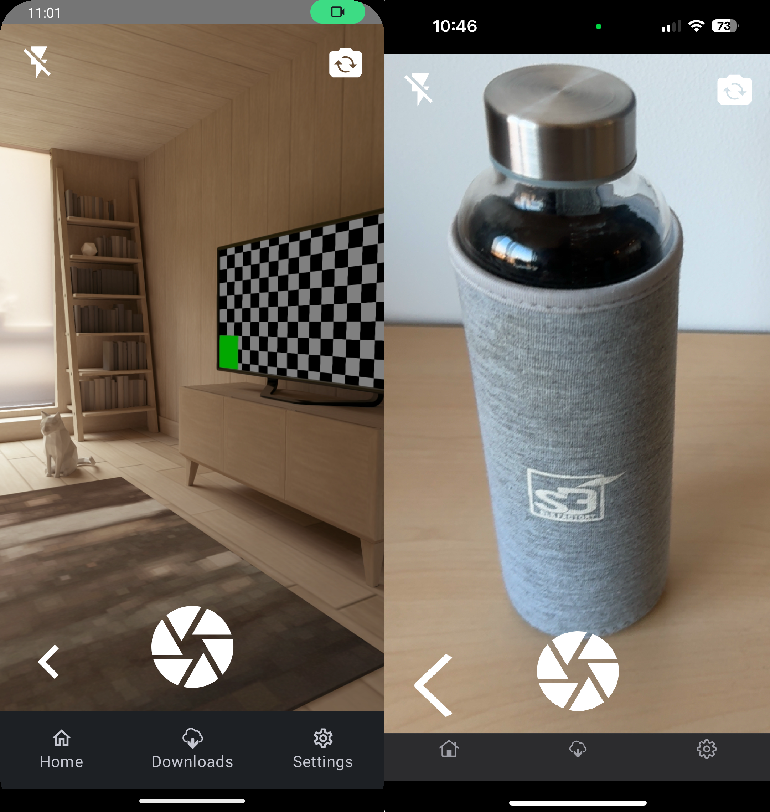
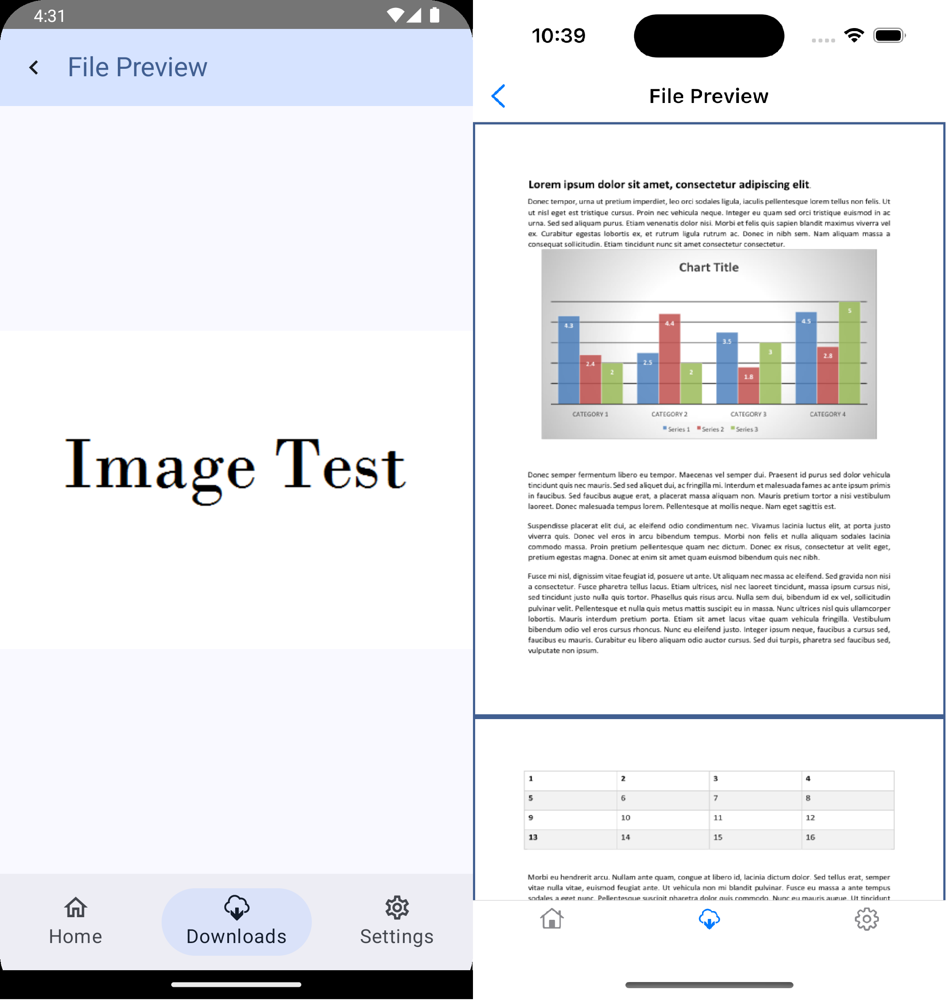
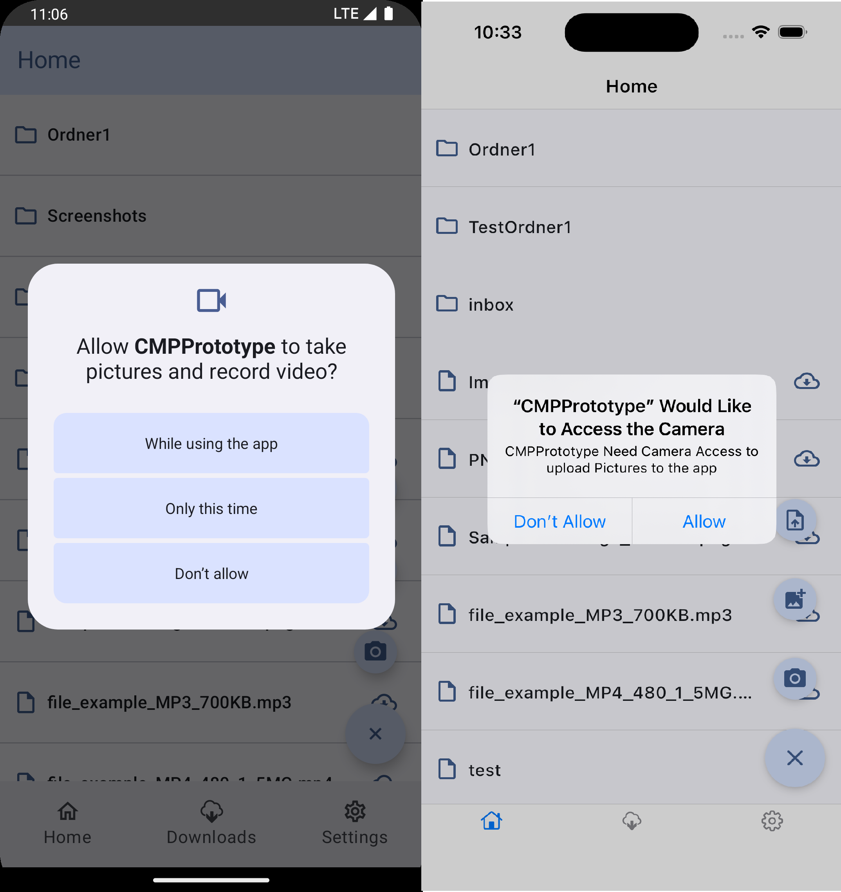
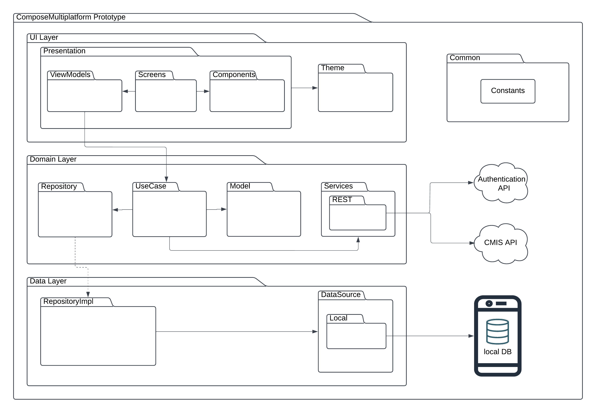

# Compose Multiplatform Prototype

## Überblick

Dieser Prototyp wurde im Rahmen einer Bachelor Thesis entwickelt, die sich mit der
Evaluation moderner Cross-Platform-Frameworks für mobile App-Entwicklung beschäftigt. Die Arbeit
vergleicht Compose Multiplatform, Flutter und React Native hinsichtlich ihrer Eignung für
geschäftliche Anwendungen. Ziel des Prototyps ist es, die Fähigkeiten von Compose Multiplatform in
Bezug auf technische Anforderungen wie Dateiverwaltung, Authentifizierung und Offline-Funktionalität
zu demonstrieren und praktische Einblicke in das Framework zu gewinnen.

### Ziel

Das Ziel dieses Prototyps ist es, eine App mit einer gemeinsamen Codebasis zu entwickeln, die
plattformspezifische Funktionen integriert, wie z. B. Dateiverwaltung, Zugriffsberechtigungen und
dynamische UI-Anpassungen.

## Hauptfunktionen

### 1. **LoginScreen** 🔑

- Eingabefelder für Serveradresse, Benutzername und Passwort.
- Authentifizierung über einen dedizierten Server.
- Speicherung von Anmeldeinformationen im sicheren Speicher (KeyStore/Keychain).
- Lokale Authentifizierung konnte im Rahmen dieser Thesis aufgrund fehlender Unterstützung nicht
  implementiert werden. Stattdessen wurde eine Checkbox als Platzhalter hinzugefügt (siehe
  Screenshot).
- Wenn bereits eine erfolgreiche Authentifizierung stattgefunden hat, kann die Checkbox genutzt
  werden, um sich über lokale Authentifizierung in die App einzuloggen. Dabei werden die
  Anmeldedaten automatisch aus dem verschlüsselten Speicher (EncryptedSharedPrefs auf Android und
  Keychain auf iOS) geholt und über REST authentifiziert.

<div style="display: flex; justify-content: center; gap: 10px; margin-top: 20px;">
  
  
</div>


---

### 2. **Home Tab (FilesScreen)** 🗂️

- Es werden nur die Namen von Dateien und Ordnern angezeigt. Wenn Dateien lokal gespeichert sind,
  wird zusätzlich der Dateipfad angezeigt.
- Wenn keine Internetverbindung vorhanden ist, leert sich die Liste, und der Nutzer wird informiert,
  dass keine Dateien geladen werden können.
- Ganz rechts von jeder Datei befindet sich ein ImageButton mit einer Wolke und einem Pfeil, der
  symbolisiert, ob die Datei remote oder lokal gespeichert ist.
- Bei Klick auf eine lokale Datei öffnet sich der Dateivorschau-Bildschirm.
- Ein Button öffnet ein Menü mit folgenden Optionen:
    - **Dateien aus dem Dateisystem auswählen**.
    - **Bilder oder Videos aus der Galerie auswählen**.
    - **Zur Kamera navigieren**, um ein Bild aufzunehmen, welches dann in die App (lokale DB)
      geladen wird.
- Obwohl Upload und Download noch nicht implementiert sind, überprüft ein Klick auf diesen
  ImageButton, ob der Nutzer sich im WLAN oder im mobilen Netz befindet. Falls mobiles Netz genutzt
  wird, wird ein AlertDialog angezeigt, der vor hohem Datenverbrauch warnt.




---

### 3. **Downloads Tab** 📥

- Zeigt alle lokalen Dateien an, die in der MongoDB gespeichert sind.
- Bei Klick auf eine Datei öffnet sich der Dateivorschau-Bildschirm.
- Dateien können über ein Mülleimer-Symbol gelöscht werden.
- Dieser Screen kann auch im Offline-Modus verwendet werden.




---

### 4. **Settings Tab** ⚙️

- Bietet zwei App-Einstellungen:
    1. **App Theme**:
        - Bei Klick öffnet sich der Bildschirm für App-Theme-Einstellungen.
        - Enthält folgende Optionen:
            - Einstellung, ob für Dark Mode die Systemeinstellungen verwendet werden sollen. Die App
              passt sich dann automatisch dem System an.
            - Einstellung, um den Dark Mode manuell zu aktivieren oder zu deaktivieren.
            - Einstellung, um eine Farbe in Hexadezimal einzugeben, um die Primärfarbe der App zu
              ändern.

    2. **Berechtigungen**:
        - Bei Klick öffnet sich der Bildschirm für Berechtigungseinstellungen.
        - Ermöglicht es, direkt zu den App-Einstellungen zu navigieren.


---

### 5. **Kamera-Vorschau** 📷

- Integration einer Kamera-Vorschau mit `CameraK`.
- Bietet folgende Einstellungen:
    - Blitz an/aus.
    - Wechsel zwischen Front- und Rückkamera.
    - Bild aufnehmen.
- Bei Bildaufnahme wird das Bild direkt in der lokalen DB gespeichert.
- Keine Videoaufnahme unterstützt.



---

### 6. **Dateivorschau** 📄

- Vorschau von Dateien in der App.
- Unterstützt Bilddateien, PDF und TXT.
- Für PDF werden plattformspezifische PDF-Renderer genutzt.
- PDF-Ansicht ist scrollbar.



---

### 7. **Berechtigungsanfrage** 🔒

- Dialoge zur Anforderung von Berechtigungen (z. B. Kamera, Speicher).
- Wenn auf Galerie, Kamera oder Dateisystem zugegriffen wird, wird zuvor die Berechtigung des
  Nutzers eingeholt.
- Wenn der Nutzer die Berechtigung ablehnt und erneut zugreifen möchte, erfolgt eine erneute
  Anfrage.
- Lehnt der Nutzer die Berechtigung wiederholt ab, wird sie dauerhaft abgelehnt. Der Nutzer wird
  informiert und erhält die Möglichkeit, direkt in die App-Einstellungen des Geräts zu wechseln, um
  die Berechtigung zu erteilen.



---

### 8. **Datei teilen** 📤

- Dateien können aus externen Apps in die App geteilt werden.
- **Android:**
    - Eingehende Intents werden verarbeitet, und die Datei wird direkt in die lokale Datenbank (
      MongoDB) geschrieben.
- **iOS:**
    - Eine Share Extension schreibt die geteilte Datei in einen App Group Container.
    - In `iosMain` wird mit Kotlin-Code auf den App Group Container zugegriffen, die Datei
      ausgelesen und anschließend in die lokale Datenbank gespeichert.
- Diese Funktion ermöglicht es, Dateien effizient in die App zu integrieren.

---

## Architektur



Das Projekt folgt einer **MVVM Clean Architecture**, die aus drei Hauptschichten besteht:

### 1. **UI Layer**

- Enthält die Präsentationslogik.
- Implementiert Screens, ViewModels und wiederverwendbare UI-Komponenten (Composables).
- Enthält auch das Theming der App.
- Nutzung von Voyager für Navigation und Screen Management.

### 2. **Domain Layer**

- Enthält die Geschäftslogik der App.
- Nutzung von Use Cases zur Trennung von Logik und Daten.
- Modelle und Services definieren die Struktur der Daten und die API-Interaktionen.

### 3. **Data Layer**

- Datenquelle der App.
- Implementierung von Repositories, die auf lokale Datenquellen zugreifen (z. B. Mongo Realm DB,
  EncryptedSharedPreferences auf Android und Keychain auf iOS).
- Die Repositories nutzen die Datenquellen zur Bereitstellung der Daten für die Domain-Schicht.
- Ein spezielles Repository nutzt das Konnectivity-Package, um den Verbindungsstatus des Geräts
  abzufragen und entsprechende Informationen bereitzustellen.

---

## Verwendete Technologien

- **Compose Multiplatform**: UI-Entwicklung für Android und iOS.
- **Voyager**: Navigation und Tab-Management.
- **MongoDB Realm**: Lokale Datenbank.
- **Koin**: Dependency Injection.
- **Ktor**: Netzwerk-Client für API-Anfragen.
- **Moko-Permissions**: Verwaltung von Berechtigungen.
- **CameraK**: Kamera-Integration.
- **AndroidX Security Crypto**: Verschlüsselte Datenspeicherung (nur Android).
- **Multiplatform Settings**: Plattformübergreifende Einstellungen.
- **Stately**: State-Management in Multiplattform-Projekten.
- **Cupertino Adaptive**: iOS-spezifische UI-Komponenten.
- **Compose Cupertino**: Plattformangepasste UI-Komponenten für iOS.
- **FileKit**: Unterstützung für Dateioperationen.
- **Image Saver Plugin**: Speicherung von Bildern.
- **Konnectivity**: Netzwerkstatus und Konnektivität.
- **Kotlinx-DateTime**: Arbeiten mit Datum und Uhrzeit.
- **Kotlin Coroutines**: Asynchrone Programmierung und Thread-Management.
- **Kotlinx Serialization**: JSON-Serialisierung und -Deserialisierung.

## Aufbau der Codebasis

Die Ordnerstruktur des Projekts:

```
common/
  data/
    datasource/
      local/
      preferences/
    repository/
  domain/
    model/
    repository/
    use_case/
    services/
  ui/
    presentation/
      components/
      screens/
    theme/
```

---

## Über den Autor

- **Name:** Alexander Metzler
- **Studiengang:** Data Science in der Medizin
- **Kooperationsfirma:** doubleSlash Net-Business GmbH
- **Hochschule:** Technische Hochschule Ulm

